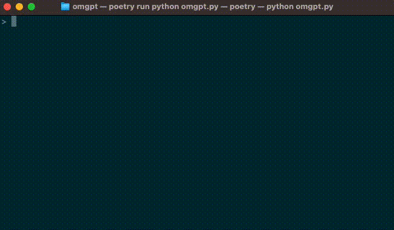

# 🐚 OMGpt Shell



## 📝 Table of Contents
1. [📚 Introduction](#-introduction)
2. [⭐ Features](#-features)
3. [⚙️️ Installation](#-installation)
4. [🎯 Usage](#-usage)
5. [🔧 Configuration](#-configuration)
6. [💡 Contributing](#-contributing)
7. [👥 Community](#-community)
8. [📜 License](#-license)
9. [🙏 Acknowledgements](#-acknowledgements)

## 📚 Introduction

Welcome to **OMGpt Shell**! 👋

OMGpt Shell is a revolutionary AI-powered command-line interface (CLI) aiming to make your interaction with your computer's shell environment as intuitive and efficient as possible.

While traditional shell environments like bash, zsh, and fish require specific commands and syntaxes that can be difficult to memorize and use, OMGpt Shell lets you control your computer in a more human way: by using natural language commands.

Think of OMGpt Shell as your personal command-line assistant. Instead of having to remember and type out specific shell commands, you can just tell OMGpt Shell what you want to do in in your preferred language. OMGpt Shell's powerful AI will interpret your command and translate it into the appropriate shell command.

OMGpt Shell can greatly simplify the process of interacting with your computer's shell environment, whether you're a beginner just learning the ropes or a seasoned power user looking for a more efficient way to work. Try OMGpt Shell today and experience the future of command-line interfaces! 🚀

## ⭐ Features

OMGpt Shell is an AI-powered command line interface designed to make your interaction with the shell more intuitive and efficient. Here are some of the key features:

1. **Natural Language Processing**: OMGpt Shell uses advanced Natural Language Processing (NLP) techniques to understand your commands. This allows you to interact with the shell in your preferred language, making it more accessible and user-friendly.

2. **Wide Range of Command Support**: From simple file operations to complex tasks like networking or system management, OMGpt Shell can translate your natural language commands into the appropriate shell commands. This reduces the need to remember specific command syntax and increases productivity.

3. **Command History**: OMGpt Shell keeps track of the commands you've used, allowing you to easily revisit and reuse them. This feature enhances efficiency and allows for easy repetition of commands.

4. **Directory Navigation**: Easily navigate through your file system with simple commands. OMGpt Shell understands your directory change commands, making file system navigation a breeze.

5. **Streaming Responses**: Get real-time feedback from OMGpt Shell. As GPT processes your commands, the responses are streamed back to you, keeping you informed every step of the way.

6. **Full Output Feature**: If you want to see the full output of the last executed command, simply press Ctrl + O. This will show you the complete standard output or error, providing you with all the details you need.

7. **Output Toggle Feature**: By default, OMGpt Shell hides the standard output of the executed commands. However, if you want to toggle the visibility of the output for future commands, you can simply press Ctrl + T.

8. **Auto-Completion for File and Directory Paths**: OMGpt Shell supports auto-completion for file and directory paths. As you start typing a path, OMGpt Shell will suggest possible completions, making it faster and easier to enter paths.

9. **Non-Interactive Mode**: OMGpt Shell supports a non-interactive mode, allowing you to use it in scripts or batch jobs, or to execute a single command without entering the interactive shell environment.

10. **Examples of use**:

   - **Example 1**: When you say, "Download the file at 'http://example.com/file' and save it as 'downloaded_file'", OMGpt Shell will execute the following:
     ```bash
     wget -O downloaded_file http://example.com/file
     ```
     If you want to see the full output of this command, press Ctrl + O. If you want to toggle the visibility of the output for future commands, press Ctrl + T.

   - **Example 2**: If you tell OMGpt Shell to "Find all the Python files in the current directory", it will execute:
     ```bash
     find . -name "*.py"
     ```
   - **Example 3**: If you say, "Check the current status of git, track and commit the newly written source code with a nice commit message", OMGpt Shell will run:
     ```bash
     git status
     git add .
     git commit -m "Automatically committed by OMGpt Shell"
     ```
   - **Example 4**: If you start typing the name of a file or directory and then press Tab, OMGpt Shell will auto-complete the path for you. For example, if you have a file named 'example.txt' in the current directory, you can just type 'exa' and then press Tab to auto-complete the file name.

By transforming your natural language inputs into appropriate shell commands, OMGpt Shell makes the process of working with a shell more intuitive, efficient, and user-friendly.

## ⚙️ Installation

You can install OMGpt Shell using pip. Make sure you have Python 3.8 or above installed.

```bash
pip install omgpt
```

## 🎯 Usage

After installation, using OMGpt Shell is simple:

1. Open your terminal.

2. Start OMGpt Shell by running the following command:

   ```bash
   omgpt
   ```

3. You'll now be in the OMGpt Shell interface. Here, instead of typing regular shell commands, you can issue commands in your preferred language. For example:

   ```bash
   > Download the file at 'http://example.com/file' and save it as 'downloaded_file'
   ```

   or

   ```bash
   > Find all the Python files in the current directory
   ```

   or

   ```bash
   > Check the current status of git, track and commit the newly written source code with a nice commit message
   ```

4. To use non-interactive mode, pass your command as an argument when starting OMGpt Shell. For example:

   ```bash
   omgpt -c "Download the file at 'http://example.com/file' and save it as 'downloaded_file'"
   ```

   This will start OMGpt Shell, execute the given command, and then exit. The output will be the same as if you had entered the command in interactive mode.

Remember, the goal of OMGpt Shell is to understand your commands in your preferred language and convert them to appropriate shell commands.

## 🔧 Configuration

To customize your user experience with OMGpt, you need to create a configuration file named `~/.omgptrc` in your home directory.

Here's a simple example of what your `~/.omgptrc` might look like:

```ini
[api]
openai_api_key = <your-openai-api-key>

[settings]
chat_model = gpt-4-0613
```

### Required Settings

The only required setting to run OMGpt properly is the OpenAI API Key:

- `openai_api_key`: You are required to input your OpenAI API key. This allows OMGpt to communicate with the OpenAI API. You can get your OpenAI API key from the [OpenAI website](https://openai.com).

### Optional Settings

These optional settings customize OMGpt to better suit your needs:

- `chat_model`: Specifies the chat model that OMGpt will use. This includes "gpt-4-0613" and "gpt-3.5-turbo-0613", among others. If it's not specified, a default model will be used. You should verify the availability of these models in your API subscription.

- `system_prompt`: Sets the behavior of the model used. The prompt should instruct the model about its function and how to generate responses. For instance, "You are a shell. Your name is OMGpt. You treat their time as precious. You are as concise as possible in responses. You need to run the next command sequentially, depending on the result of the previous command, without prompting the user if necessary. You should run a command to get information about system. Use friendly, appropriate emoticons when responding to users."

- `temperature`: Controls the diversity of the model's responses. A higher value (nearer to 1) produces more various outputs, while a lower value creates more deterministic responses.

After modifying your `~/.omgptrc`, don't forget to save it and restart OMGpt for the changes to apply. More details about the models and their behaviors can be found in the [official OpenAI API documentation](https://docs.openai.com/en/).

## 💡 Contributing

We welcome contributions to OMGpt Shell! Whether it's reporting bugs, suggesting new features, improving documentation, or contributing code, your help is greatly appreciated.

Here are some ways you can contribute:

1. **Reporting Bugs**: If you encounter any bugs or issues while using OMGpt Shell, please open an issue on our GitHub repository. Be sure to include as much detail as possible so we can understand and reproduce the problem.

2. **Suggesting Features**: Have an idea for a new feature or an improvement to an existing one? Open an issue and label it as a feature request. Please provide as much detail as possible about your suggestion.

3. **Improving Documentation**: Good documentation makes a great project even better. If you notice any areas of our documentation that could be improved, or if you want to add new tutorials or guides, feel free to make the changes and submit a pull request.

4. **Contributing Code**: If you're a developer and want to contribute code to OMGpt Shell, we'd love to see your pull requests. Please make sure to follow our coding standards and guidelines.

We appreciate all contributions, no matter how small. Thank you for your support! 👩‍💻👨‍💻

## 👥 Community

One of the goals of the OMGpt project is to foster a community of users and contributors. We believe that community feedback and collaboration is key to creating a versatile and user-friendly shell.

We strongly encourage all users of OMGpt Shell to share their usage cases and experiences. Did you use OMGpt Shell to automate a tedious task? Have you come up with an ingenious command that you'd like to share? We'd love to hear about it!

Our community mainly communicates via Discord. Our server is a place for you to share your experiences, ask questions, and get help with any issues you might encounter. It's also a place where you can share your own ideas and contributions to the project.

We're excited to hear about the diverse ways in which you are using OMGpt Shell, and we believe that sharing these experiences can help make OMGpt Shell even better. Join our Discord server and become part of the OMGpt Shell community!

- Join our Discord server: [here](https://discord.gg/yxp9v2Nf)

## 📜 License

OMGpt Shell is licensed under the MIT License. This means you are free to use, copy, modify, merge, publish, distribute, sublicense, and/or sell copies of the software, subject to the following conditions:

1. The above copyright notice and this permission notice shall be included in all copies or substantial portions of the Software.

2. THE SOFTWARE IS PROVIDED "AS IS", WITHOUT WARRANTY OF ANY KIND, EXPRESS OR IMPLIED, INCLUDING BUT NOT LIMITED TO THE WARRANTIES OF MERCHANTABILITY, FITNESS FOR A PARTICULAR PURPOSE AND NONINFRINGEMENT. IN NO EVENT SHALL THE AUTHORS OR COPYRIGHT HOLDERS BE LIABLE FOR ANY CLAIM, DAMAGES OR OTHER LIABILITY, WHETHER IN AN ACTION OF CONTRACT, TORT OR OTHERWISE, ARISING FROM, OUT OF OR IN CONNECTION WITH THE SOFTWARE OR THE USE OR OTHER DEALINGS IN THE SOFTWARE.

For more details, please see the [LICENSE](LICENSE) file in our GitHub repository.

## 🙏 Acknowledgements

We would like to express our deepest gratitude to the following individuals and organizations for their contributions to OMGpt Shell:

- **OpenAI**: For developing the GPT models that power OMGpt Shell's natural language processing capabilities.
- **All Contributors**: For their invaluable contributions to the project, whether it's reporting bugs, suggesting features, improving documentation, or contributing code.

We would also like to thank all users of OMGpt Shell for their support and feedback. Your enthusiasm and interest in our project have been a major driving force behind our work.

Lastly, we would like to acknowledge all the open source projects that have inspired us and made this project possible. We are proud to be part of the open source community and look forward to giving back.

Thank you all! 💖
